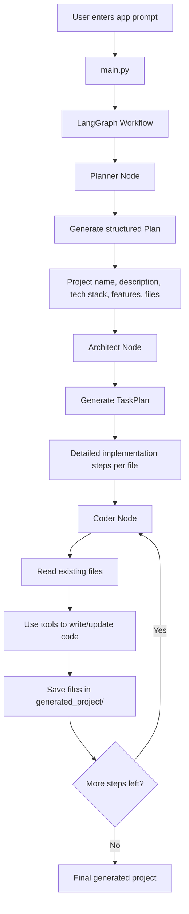

# App-Builder

An **AI-powered application generator** built with **LangGraph**, **LangChain**, and **ChatGroq**.

This project takes a natural language app idea from the user, converts it into a structured engineering plan, breaks that plan into implementation steps, and then automatically generates the required project files inside a target folder.

---

## Overview

`App-Builder` is designed as a **multi-stage code generation pipeline**.

Instead of directly generating code from one prompt, the system follows a structured workflow:

1. **Planner** → converts the user request into a complete project plan  
2. **Architect** → transforms the plan into detailed implementation tasks  
3. **Coder** → iteratively reads and writes files to generate the actual project  

This makes the system more modular, explainable, and easier to extend compared to a single-prompt code generator.

---

## Workflow



---

## How It Works

### 1. User Prompt Input
The application starts by asking the user for a project idea:

```text
Enter your project prompt:
```

Example prompts:
- Build a simple calculator web application
- Create a modern todo app in HTML, CSS, and JavaScript
- Build a personal finance tracker

---

### 2. Planner Stage
The **Planner** agent takes the raw user request and converts it into a structured `Plan`.

The plan includes:
- app name
- short description
- tech stack
- feature list
- list of files to create

This stage ensures that the user idea is first converted into a clean engineering specification.

---

### 3. Architect Stage
The **Architect** agent receives the structured plan and breaks it into detailed implementation steps.

Each step specifies:
- which file should be created or modified
- what exactly should be implemented
- variables, functions, or components to define
- dependency order between files
- integration details between modules

This stage converts a high-level idea into a practical execution plan.

---

### 4. Coder Stage
The **Coder** agent executes the implementation tasks one by one.

It:
- reads existing file contents
- reviews the current project structure
- updates or creates files
- writes the generated code into the target project directory

This stage is tool-driven and uses file read/write utilities for controlled code generation.

---

## Architecture

This project is built around a **LangGraph workflow** with three core nodes:

### Planner
Converts the user prompt into a structured engineering project plan.

### Architect
Transforms the project plan into a detailed task-by-task implementation sequence.

### Coder
Executes each implementation step using file tools and generates the project files.

---

## Core Components

### `main.py`
The main entry point of the project.  
It reads the user prompt from the terminal and invokes the LangGraph workflow.

### `agent/graph.py`
Defines the graph workflow and connects:
- `planner_agent`
- `architect_agent`
- `coder_agent`

### `agent/prompts.py`
Contains the system prompts used by the Planner, Architect, and Coder stages.

### `agent/states.py`
Defines the structured Pydantic models used across the workflow:
- `Plan`
- `TaskPlan`
- `ImplementationTask`
- `CoderState`

### `agent/tools.py`
Provides controlled file operations such as:
- reading files
- writing files
- listing files
- resolving safe project paths

All generated files are written inside:

```text
generated_project/
```

---

## Project Structure

```text
App-Builder/
├── agent/
│   ├── graph.py
│   ├── prompts.py
│   ├── states.py
│   ├── tools.py
│   └── generated_project_todo_app/
│
├── generated_project/
├── Planner.md
├── main.py
├── pyproject.toml
├── uv.lock
└── README.md
```

---

## Features

- Natural language to app generation
- Structured planning before coding
- Multi-stage LangGraph workflow
- File-by-file implementation strategy
- Safe file generation inside a dedicated output folder
- Modular design for extending planners, coders, or tools
- Pydantic-based structured outputs
- Reusable for multiple small app ideas

---

## Input and Output

### Input
A natural language app request, for example:

```text
Build a simple calculator web application
```

### Output
A generated codebase written into:

```text
generated_project/
```

Depending on the prompt, the system can generate files such as:
- `index.html`
- `style.css`
- `script.js`
- `README.md`

---

## Example Use Case

A sample planning example in the repository shows a calculator app with:
- HTML structure
- CSS styling
- JavaScript logic
- responsive design
- keyboard input support
- clear and backspace functionality

The repository also contains a sample generated todo app in:

```text
agent/generated_project_todo_app/
```

which includes:
- `index.html`
- `styles.css`
- `script.js`
- `README.md`

---

## Tech Stack

- **Python**
- **LangGraph**
- **LangChain**
- **ChatGroq**
- **Pydantic**
- **python-dotenv**

---

## Installation

### 1. Clone the repository

```bash
git clone https://github.com/shivanimadhavan/App-Builder.git
cd App-Builder
```

### 2. Install dependencies

Using `uv`:

```bash
uv sync
```

Or using `pip`:

```bash
pip install -r requirements.txt
```

> If you do not have a `requirements.txt`, install dependencies from `pyproject.toml`.

---

## Run the Project

```bash
python main.py
```

You can also pass a custom recursion limit:

```bash
python main.py --recursion-limit 100
```

---

## Example Execution Flow

```text
Enter your project prompt:
Build a colourful modern todo app in html css and js

Step 1: Planner creates a structured project plan
Step 2: Architect breaks the plan into implementation steps
Step 3: Coder generates files one by one
Step 4: Final project is saved inside generated_project/
```

---

## Design Notes

- The project uses a **graph-based workflow** instead of a single LLM call.
- The generation pipeline is divided into planning, architecture, and coding for better control.
- File generation is restricted to a safe project root directory.
- The coder works iteratively, which makes the system easier to debug and improve.

---

## Why This Project Matters

This project demonstrates how LLMs can be used not just for direct code completion, but for **structured software generation**.

It is a good example of:
- workflow-based AI engineering
- code generation with planning
- LangGraph orchestration
- tool-augmented coding agents
- safe file-based automation

---

## Future Improvements

- support more complex multi-file applications
- add testing and validation steps
- generate frontend and backend projects together
- add preview or execution environment for generated apps
- improve error handling and retry logic
- support framework-based generation such as React, FastAPI, or Flask

---

## Author

**Shivani Madhavan**
